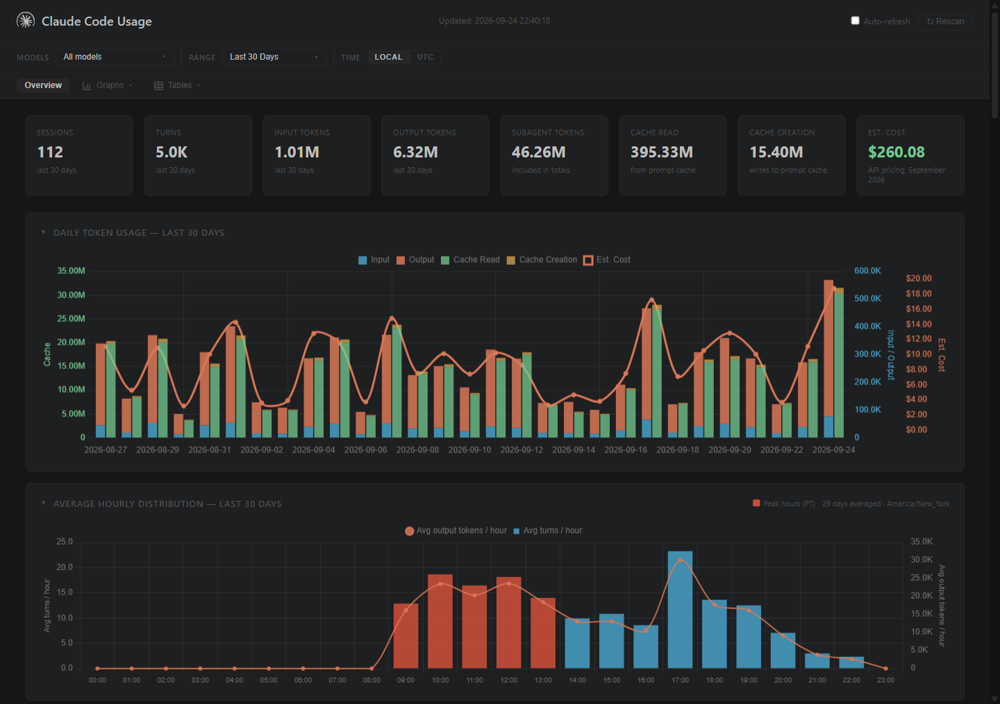

# claude-usage

[](LICENSE)
[](https://github.com/ollo12-prog/claude-usage/actions/workflows/tests.yml)
[](https://github.com/ollo12-prog/claude-usage/releases)

**A local dashboard for what your Claude Code usage costs at API prices, per turn and per model.**

Claude Code logs every API response to local JSONL files: tokens, model, cache writes, tools, subagents, MCP servers. This tool reads those logs into SQLite and shows where the tokens went. It runs on your machine and uses only the Python standard library. Your usage data never leaves it: the page only loads Chart.js from a CDN and checks GitHub for new releases. It works whether you're on an API key, Pro, or Max.



<sub>Screenshot uses synthetic demo data.</sub>

---

## Why this fork

This is a hard fork of [phuryn/claude-usage](https://github.com/phuryn/claude-usage). It split off at upstream v1.5.5, began as fixes to the cost math, and has since grown into a separate tool. The main difference is accuracy. Most of these fixes turned up when the numbers were reconciled against real sessions, either against Claude Code's own `total_cost_usd` or turn by turn against a second ledger:

- **Advisor calls are counted.** An `advisor` call is a separate inference on another model. Its tokens sit in `usage.iterations[]`, not in the top-level usage, so upstream billed them at $0. On two real sessions that was a **40% undercount**.
- **1-hour cache writes cost 2× input**, not the 5-minute rate of 1.25×.
- **Mixed-model sessions are priced per model.** Upstream priced the whole session at its primary model's rate, so Haiku subagent tokens were billed as Opus. One real session came out **9.6% high**.
- **Current price sheet.** The table includes Opus 5.5 (cache reads at 0.05×), Fable/Mythos 5.1 (cache reads at 0.025×), Opus 5, and Sonnet 5 at $2/$10.
- **Range edges.** "Last 7 days" really is 7 days, and days are bucketed in local time. The old UTC bucketing was **$85 off** on one real 7-day window. A **UTC/local toggle** lines the numbers up with Claude's own usage page, which reports in UTC.
- **Streaming and incremental scans.** A scan that runs while a response is still streaming no longer freezes its partial token count.

Views added since the fork (a few started as upstream PRs that were never merged there):

- **Cost by MCP server** and **top tools by cost**
- **Expensive session signals**, which flag the sessions that ran up the bill
- **Subagent dispatches**, named even when launched in the background
- **History that outlives your transcripts.** Claude Code prunes old JSONL files, but the database only grows. Neither a scan nor the Rescan button deletes a row.
- **Cost by project & branch**. Git worktrees fold into their parent repo.
- **Session drilldown**: a timeline, per-turn table and tool breakdown
- An **editable pricing table** for negotiated rates or new models. Your edits are saved in the browser.
- CSV export on every table, and opt-in auto-rescan every 30 seconds

Released changes are listed in the [CHANGELOG](CHANGELOG.md), most with before and after numbers.

---

## What it reads

- **Claude Code CLI**, **IDE extensions**, the **desktop app's Code tab**, and dispatched sessions. All of them write to `~/.claude/projects/`.
- **Xcode's Claude integration** (`~/Library/Developer/Xcode/CodingAssistant/ClaudeAgentConfig/projects/`)

It can't see anything that doesn't write local transcripts: claude.ai chat, Cowork, and cloud sessions.

---

## Install

Requires Python 3.8+. There are no third-party packages.

### uv / pipx (any OS)
```
uv tool install git+https://github.com/ollo12-prog/claude-usage
claude-usage dashboard
```
`pipx install git+https://github.com/ollo12-prog/claude-usage` also works.

### Homebrew (macOS / Linux)
```
brew tap ollo12-prog/claude-usage https://github.com/ollo12-prog/claude-usage
brew install ollo12-prog/claude-usage/claude-usage
claude-usage dashboard
```
The formula installs the most recent tagged release, which can trail `main` (see [AGENTS.md](AGENTS.md#homebrew-formula-and-self-referential-sha) for why). Use `uv` or a clone to get the latest.

### From a clone
```
git clone https://github.com/ollo12-prog/claude-usage
cd claude-usage
python cli.py dashboard      # python3 on macOS/Linux
```

### Docker
```
git clone https://github.com/ollo12-prog/claude-usage
cd claude-usage
bash scripts/run-docker.sh
```
This serves the dashboard on **http://localhost:9898**. `~/.claude` is mounted read-only, and the database lives in a named volume (`claude-usage-data`).

---

## Usage

The examples use `claude-usage`. From a clone, run `python cli.py` instead.

```
claude-usage dashboard                  # scan, then serve http://localhost:8080
claude-usage dashboard --host 0.0.0.0 --port 9000
claude-usage scan                       # incremental scan into ~/.claude/usage.db
claude-usage today                      # today's usage by model
claude-usage week                       # last 7 days, per day and by model
claude-usage stats                      # all-time totals, by model, top projects
claude-usage scan --projects-dir PATH   # scan a custom transcripts directory
claude-usage --version
```

| Env var | Default | Effect |
|---|---|---|
| `HOST` / `PORT` | `localhost` / `8080` | Dashboard bind address |
| `CLAUDE_USAGE_DB` | `~/.claude/usage.db` | Database location |

Scans are incremental. Each file's mtime and line count are tracked, so a re-scan only reads what's new. The dashboard's **Rescan** button runs the same incremental scan. Filters (models, range, UTC/local) are kept in the URL, so you can bookmark a view.

---

## How costs are calculated

Each turn is priced at its own model's rate, and the results are summed. For each assistant response the scanner stores:

- `input_tokens`, `output_tokens`, `cache_read_input_tokens`
- `cache_creation_input_tokens`, split by `cache_creation.ephemeral_5m_input_tokens` / `ephemeral_1h_input_tokens`
- each `usage.iterations[]` entry of type `advisor_message`, stored as its own turn priced at `advisorModel`

Claude Code writes several records per streamed response, so only the last record for each `message.id` counts.

### Prices

These are Anthropic API list prices, checked against [platform.claude.com pricing](https://platform.claude.com/docs/en/about-claude/pricing) on 2026-09-24, in $/MTok. The source of truth is `PRICING` in [cli.py](cli.py), which is mirrored in the dashboard. You can override any rate in the dashboard's pricing editor.

| Model | Input | Output | Cache write 5m | Cache write 1h | Cache read |
|---|---|---|---|---|---|
| Fable 5.1 / Mythos 5.1 | 10.00 | 50.00 | 12.50 | 20.00 | **0.25** |
| Fable 5 / Mythos 5 | 10.00 | 50.00 | 12.50 | 20.00 | 1.00 |
| Opus 5.5 | 4.00 | 20.00 | 5.00 | 8.00 | **0.20** |
| Opus 5, 4.8, 4.7, 4.6, 4.5 | 5.00 | 25.00 | 6.25 | 10.00 | 0.50 |
| Sonnet 5 | 2.00 | 10.00 | 2.50 | 4.00 | 0.20 |
| Sonnet 4.6, 4.5 | 3.00 | 15.00 | 3.75 | 6.00 | 0.30 |
| Haiku 4.5 | 1.00 | 5.00 | 1.25 | 2.00 | 0.10 |

Model IDs resolve by exact match first, then by prefix (so dated IDs work), then by family keyword. Anything that doesn't match, such as local models or other vendors, shows as `n/a` and costs $0, so it never gets billed at Claude rates by accident.

**Limitations.** These figures are API-equivalent estimates. A Pro or Max subscription doesn't bill per token. Two price modifiers aren't applied yet: fast mode (2× on Opus) and the 1.1× US data-residency multiplier. Sessions that use either will show a lower cost than the real one.

---

## Files

| Path | Purpose |
|---|---|
| `scanner.py` | Parses JSONL transcripts into SQLite |
| `cli.py` | `scan` / `today` / `week` / `stats` / `dashboard`, and the pricing table |
| `dashboard.py` | stdlib HTTP server plus the single-page dashboard (Chart.js from CDN) |
| `tests/` | `python -m unittest discover -s tests` (CI runs Python 3.9, 3.11, 3.12) |
| `pyproject.toml` | Packaging for `uv tool` / `pipx` (no runtime dependencies) |
| `Formula/claude-usage.rb` | Homebrew formula |
| `Dockerfile`, `scripts/run-docker.sh` | Container build and run |

For contributors and coding agents, [AGENTS.md](AGENTS.md) covers the architecture, the invariants that matter, and the release flow.

---

## Credits

Forked from [phuryn/claude-usage](https://github.com/phuryn/claude-usage) by Paweł Huryn ([The Product Compass](https://www.productcompass.pm)). Upstream contributors keep their commits and credit; see the CHANGELOG. If you're on a subscription and want to stop runaway sessions rather than just measure them, look at his companion project [burnstop](https://github.com/phuryn/burnstop).

MIT licensed.
